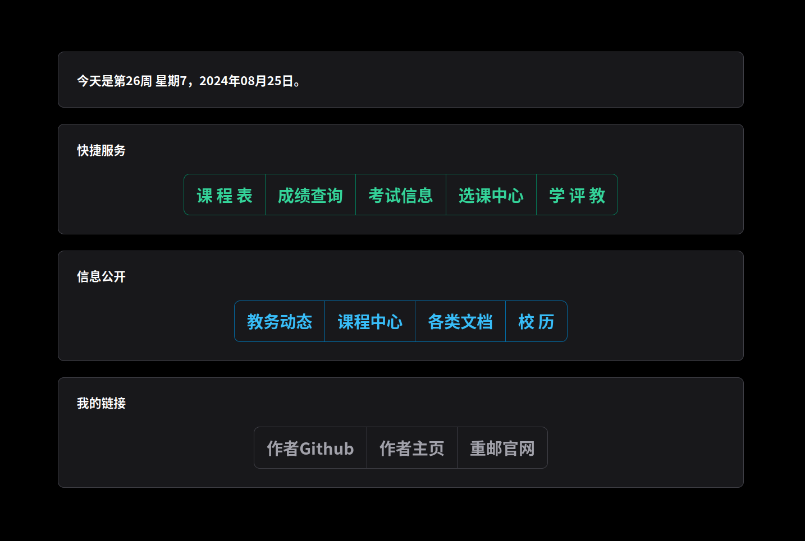
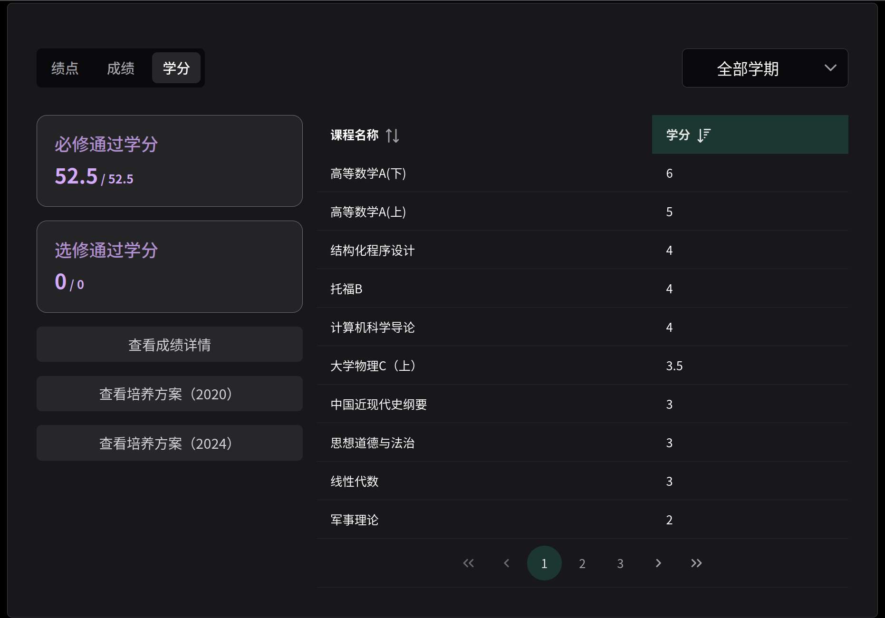

# CQUPT-Art 邮艺思

## 简介

一个重庆邮电大学「教务在线」的油猴脚本插件，全面重构原版教务的页面，聚焦关键信息，为学生提供流畅体验。

## 技术架构

- [vite-plugin-monkey](https://github.com/lisonge/vite-plugin-monkey)：基于Vite的插件，可将Vue等主流框架代码编译成UserScript。
- [Vue3](https://cn.vuejs.org/)：现代前端框架。
- [TailwindCSS](https://tailwindcss.com/)：原子类CSS框架。
- [PrimeVue](https://cn.vuejs.org/)：最优秀的Vue组件样式库。

## 特色

- 📱 响应式设计：基于Tailwind CSS的响应式，手机端能获得媲美电脑端的体验。
- 🌙 暗黑模式：基于PrimeVue的样式模式，日间/夜间模式随浏览器设置随心改变。
- 🐒 油猴脚本：不同于我校另外两个出色的项目（掌上重邮、We重邮），插件完全静态地基于网页的解析，不用担心服务器宕机和隐私泄露。

## 页面预览

## 如何使用

### 电脑端

使用Chrome、Firefox等常见浏览器下载插件「[TamperMonkey](https://www.tampermonkey.net/)」，导入本仓库中`release`文件夹下的UserScript脚本。

访问[jwzx.cqupt.edu.cn]()，即可开始使用。

### 手机端

建议使用[Via浏览器](https://viayoo.com/zh-cn/)，更轻便易用。在设置 - 脚本处导入本仓库中`release`文件夹下的UserScript脚本即可。

您也可使用手机版的Firefox浏览器安装油猴插件，方法与电脑端类似。访问[jwzx.cqupt.edu.cn]()，即可开始使用。

## 未来更新内容

- 📅 课程表解析（基于开源项目CQUPT-ics）
- 📄 成绩详情页面
- 🔗 添加自己的链接

